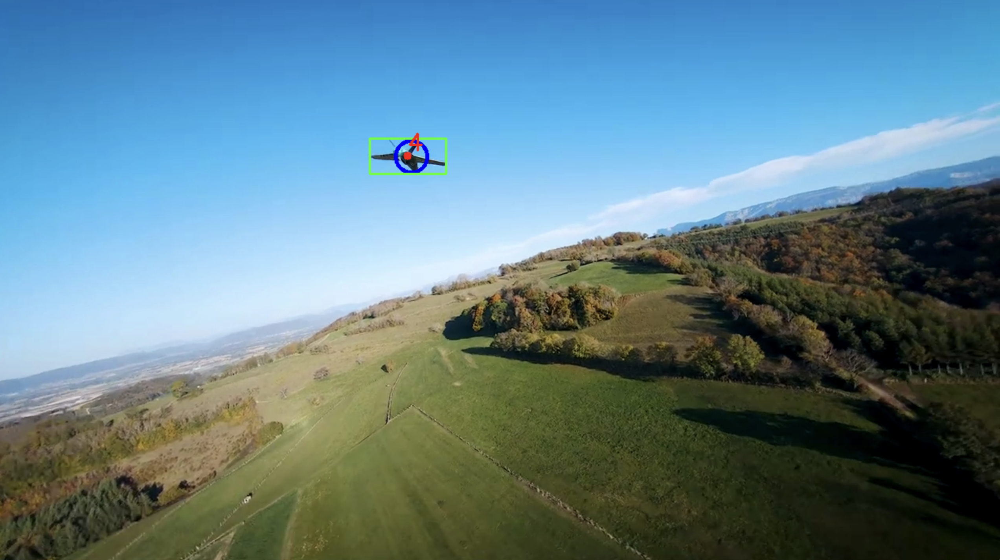

## Demo of the Project: 



### Image Description:

Displayed is a demonstration showcasing UAV detection and tracking. A green bounding box encloses the unmanned aerial vehicle (UAV), detected utilizing the pre-trained YOLOv4 object detection algorithm. The red dot located at the center represents the coordinates (cx, cy) of the bounding box, where 'cx' denotes the center x-coordinate and 'cy' denotes the center y-coordinate. Additionally, the blue circle illustrates the projection generated by the Kalman Filter. The Kalman Filter predicts the next position of the center point of the bounding box, providing coordinates (x, y) for the anticipated location.

## How to Setup and Run the Project:

### Parameters that can be changed:

1. **Choose Video for Detection and Tracking:**
   - Add a new video to the "assets" folder in the root directory.
   - Set the name of the video as "VIDEO_OF_INTEREST" in the "main.py" source file.

2. **Update Object Detection Parameters:**
   - In the "main.py" source file, adjust the following parameters when initializing the YOLOv4 object detector:
     - `nms_threshold`: Non-maximum suppression threshold (default: 0.4)
     - `conf_threshold`: Confidence threshold (default: 0.5)
     - `image_size`: Size of input images (default: 608)

3. **Update Object Tracking Settings:**
   - In the "main.py" source file, when initializing object tracking, adjust the following settings:
     - `detect_time`: Optional[float] = None
     - `kf_time`: Optional[float] = None
   - These parameters decide whether interval mode should be enabled when tracking.
   - If `detect_time` is set, you must also include `kf_time`.
   - `detect_time`: Time interval (in seconds) for enabling the detector to detect in each frame before switching to Kalman filter only mode.
   - `kf_time`: Time interval (in seconds) for which the Kalman filter predicts the position of the object after the detector is disabled.
   - If both `detect_time` and `kf_time` are not defined (None), the system will detect, track, and predict in each frame.
   - Omitting both parameters allows for assessing the performance of the Kalman filter. In this mode, the Kalman filter is responsible for predicting the position of objects even when the detector fails to produce detections. This scenario occurs when the detector is activated but unable to detect objects due to various reasons, such as occlusions or low visibility.
  
### Prerequisites:
- Ensure `pip` is up to date.
- Make sure environment variables are set properly in a `.env` file.

### Installation:
1. **Update Pip:**
   - Before proceeding, ensure you have the latest version of pip installed by running:
     ```
     pip install --upgrade pip
     ```

2. **Install Dependencies:**
   - Navigate to the project directory.
   - Install project dependencies by running:
     ```
     pip install -r requirements.txt
     ```

### Running the Project:
1. **Set Environment Variables:**
   - Ensure that the `.env` file in the project directory contains the following variable:
     ```
     BASE_FILE_PATH=<absolute-path-to-project-folder>
     ```

2. **Execute the Main Script:**
   - Navigate to the project directory.
   - Run the main Python script using the following command:
     ```
     python3 ./src/main.py
     ```

---

## How This Project Works:

This project combines object detection using a pre-trained YOLOv4 algorithm with custom object tracking utilizing a tracking-by-detection approach.


### Object Detection:
- **YOLOv4 Algorithm:**
  - Utilizes a pre-trained YOLOv4 algorithm for object detection, known for its real-time capabilities.

### Object Tracking:
- **Custom Tracker:**
  - Employs a tracking-by-detection approach, comparing detected objects with those from the previous frame.
  - Assigns unique IDs to identified objects for tracking.

### Kalman Filter Integration:
- **Prediction Enhancement:**
  - Incorporates a Kalman Filter from OpenCV for predicting the next position of bounding boxes, improving tracking accuracy.
  - Utilizes both current and past information for estimation (probabily delta x and delta y of central point of bounding box).

### Additional Features:
- **Time-Based Mode Switching:**
  - Switches between detection mode and Kalman filter mode based on specified time intervals, optimizing performance.

### Performance Monitoring:
- **Detection and Prediction Time:**
  - Monitors detection and prediction times to evaluate performance.
  - Helps identify areas for optimization.

### Cleanup and Resource Management:
- **Proper Resource Handling:**
  - Ensures proper resource handling by releasing video capture objects and closing OpenCV windows upon completion.
  - Prevents resource leaks and ensures smooth operation.
